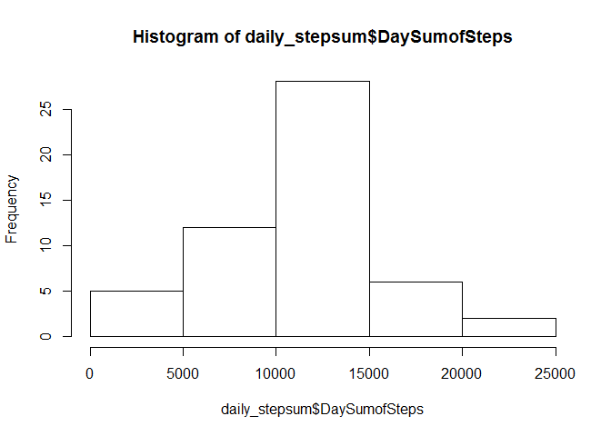
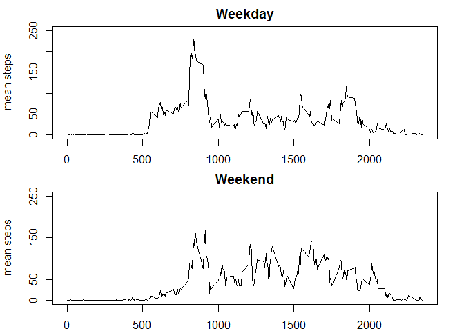

# Coursera - Reproducible Research - Course Project 1
Larry Riggen  
February 2016  
**Project Overview**

This goal of this project is to produce an R markdown file and its resulting HTML output as per the project instructions
 

**Loading and Processing the data**

1. Load the data (i.e. read.csv()) 

  Note: The "https://d396qusza40orc.cloudfront.net/repdata-data-activity.zip"  was dowloaded and unzipped into the working directory.
        This analysis is based on a download performed on February 4, 2016


```r
# Set the working directory and read in the file
setwd("E:/Coursera Data Scientist/Reproducible Research/Project1")
activity <- read.csv("./activity.csv",header=TRUE)
```

2. Process/Transform the data

   Note: Transformations are performed throughout the analysis as needed for each step
   
**What is the mean total number of steps taken per day?**

1. Calculate the number of steps per day (ignoring missing values)


```r
daily_stepsum <- aggregate(activity$steps, by=list(activity$date), FUN=sum)
names(daily_stepsum)[names(daily_stepsum)=="Group.1"] <- "date"
names(daily_stepsum)[names(daily_stepsum)=="x"] <- "DaySumofSteps"
```

2. Make a histogram of the number of steps taken per data.


```r
hist(daily_stepsum$DaySumofSteps)
```

 

3. Calculate and report the mean and median of the total number of steps per day.

```r
mean(daily_stepsum$DaySumofSteps,na.rm=TRUE)
```

```
## [1] 10766.19
```

```r
median(daily_stepsum$DaySumofSteps,na.rm=TRUE)
```

```
## [1] 10765
```

**What is the the average daily activity pattern?**

1. Make a time series plot (i.e. type="l") of the 5-minute interval (x-axis) and the average number of steps taken, averaged across all days (y-axis)


```r
intmean<-aggregate(activity[,1], list(activity$interval), mean,na.rm=TRUE)
names(intmean)[names(intmean)=="Group.1"] <- "interval"
names(intmean)[names(intmean)=="x"] <- "intervalmean"
plot(intmean$interval,intmean$intervalmean,type="l")
```

 

2. Which 5-minute interval, on average across all days in the dataset, contains the maximum number of steps?


```r
# find the maximum number of steps in an interval
maxintervalmean<-max(intmean$intervalmean)
# Display the maximum number of steps and the interval it belongs to.
maxinterval<-intmean[(intmean$intervalmean==maxintervalmean),]
maxinterval
```

```
##     interval intervalmean
## 104      835     206.1698
```


**Imputing missing values**

1. Calulate and report the total number of missing values in the dataset (i.e.the total number of rows with NAs)


```r
# Display the number of rows in the dataframe
nrow(activity)
```

```
## [1] 17568
```

```r
# Display the number of rows where steps is NA
nrow(activity[is.na(activity$steps),])
```

```
## [1] 2304
```

2. Devise a strategy for filling in all of the missing values in the dataset.

   Note: For this analysis the mean of the number of steps for the interval across all days will be used for filling in the missing values.

3. Create a dataset that is equal to the original dataset, but with the missing data filled in.
   

```r
# Merge the average number of steps for each interval created in  step 1. of "What is the the average daily activity pattern? 
# with the activity data frame by interval.
library(sqldf)
actprep  <- sqldf("SELECT steps,date,interval,intervalmean 
                   FROM activity
                   LEFT JOIN intmean USING(interval)")
# Create a new variable impute.steps containing either the non-missing step count or the average steps for the interval
library(dplyr)
actimpute<-mutate(actprep,impute.steps=ifelse(is.na(steps)==TRUE,intervalmean,steps))
```
  
4. Make a histogram of the total number of steps taken each data.


```r
daily_stepsum_impute <- aggregate(actimpute$impute.steps, by=list(actimpute$date), FUN=sum)
names(daily_stepsum_impute)[names(daily_stepsum_impute)=="Group.1"] <- "date"
names(daily_stepsum_impute)[names(daily_stepsum_impute)=="x"] <- "DaySumofSteps"
hist(daily_stepsum_impute$DaySumofSteps)
```

 

4. Calculate and report the mean and the median of the total number of steps per day


```r
mean(daily_stepsum_impute$DaySumofSteps)
```

```
## [1] 10766.19
```

```r
median(daily_stepsum_impute$DaySumofSteps)
```

```
## [1] 10766.19
```

4. Do this values differ from the estimates in the first part of the assignment?

   Yes.
   
4. What is the impact of imputing the missing data on the estimates of the total daily steps?

   In this case (using the mean of the intervals to replace NAs), the mean remained the same, by the median changed.

**Are there differences in activity patterns between weekdays and weekends?**

1. Create a new factor variable with two levels - "weekday" and "weekend", indicating whether a given data is a weekday or weekend day.


```r
# Create a POSIX date variable from the factor date variable
actimpute$dateasdate<-strptime(activity$date,"%Y-%m-%d")
# Determine the day of the week from the POSIX date variable and place it into DayOfWeek
actimpute$DayOfWeek<-weekdays(actimpute$dateasdate)
# Use DayOfWeek to place weekday or weekend into the WdayWend variable
actimpute<-mutate(actimpute,WdayWend=ifelse(DayOfWeek=="Saturday" | DayOfWeek=="Sunday","weekend",
                                     ifelse(DayOfWeek=="Monday" | DayOfWeek=="Tuesday" | DayOfWeek=="Wednesday" | DayOfWeek=="Thursday" |                                                    DayOfWeek=="Friday","weekday", NA)))
# Make WdayWend a factor variable
actimpute[,'WdayWend'] <- as.factor(actimpute[,'WdayWend'])
# Verify weekday and weekend are assigned properly
table(actimpute$DayOfWeek,actimpute$WdayWend)
```

```
##            
##             weekday weekend
##   Friday       2592       0
##   Monday       2592       0
##   Saturday        0    2304
##   Sunday          0    2304
##   Thursday     2592       0
##   Tuesday      2592       0
##   Wednesday    2592       0
```

2. Make a panel plot containing a time series plot (i.e. type='l') of the 5-minute interval (x-axis) and the average number of steps taken, averaged across all weekdays or weekend days (y-axis). 


```r
# get the average steps by interval for weekday abd weekend
intmeanWdWE<-aggregate(actimpute[,5], list(actimpute$WdayWend,actimpute$interval), mean,na.rm=FALSE)
names(intmeanWdWE)[names(intmeanWdWE)=="Group.1"] <- "WdayWend"
names(intmeanWdWE)[names(intmeanWdWE)=="Group.2"] <- "interval"
names(intmeanWdWE)[names(intmeanWdWE)=="x"] <- "intervalmean"
# create dataframes for weekday interval means and weekend interval means
weekday_ints<-intmeanWdWE[intmeanWdWE$WdayWend=="weekday",]
weekend_ints<-intmeanWdWE[intmeanWdWE$WdayWend=="weekend",]
# set up the plot frame and execute the plots.
par(mfrow = c(2, 1))
plot(weekday_ints$interval,weekday_ints$intervalmean,type="l",main="Weekday",xlab="interval",ylab="mean steps",ylim=c(0,250))
plot(weekend_ints$interval,weekend_ints$intervalmean,type="l",main="Weekend",xlab="interval",ylab="mean steps",ylim=c(0,250))
```

 


